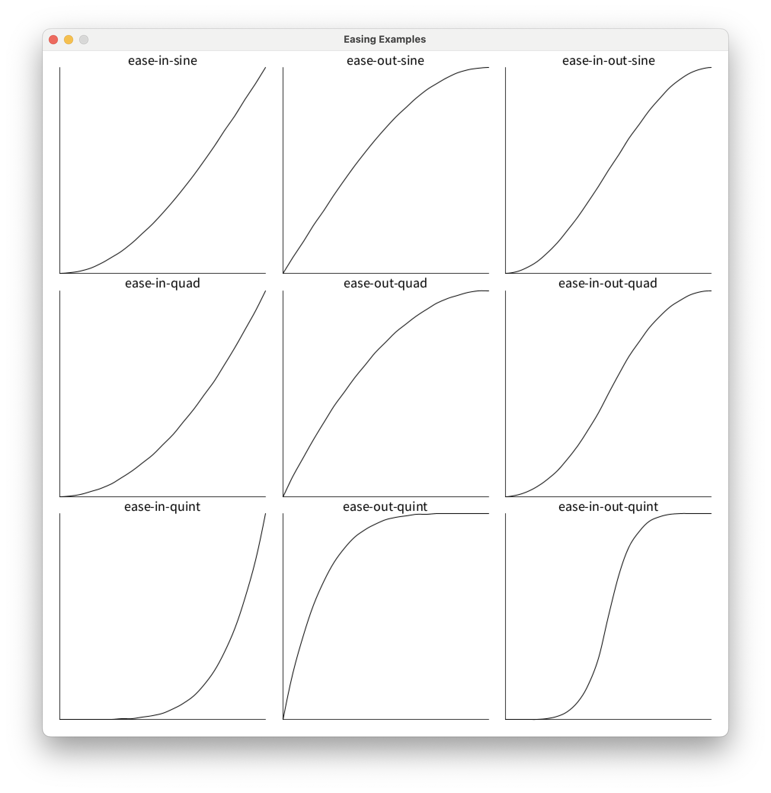

# easings-clj

[](https://clojars.org/com.dedovic/easings-clj)

A Clojure port of the [easings.net](https://easings.net) easing functions. Orignal source code may be found at [ai/easings.net](https://github.com/ai/easings.net).

## Install
Leiningen/Boot
```clojure
[com.dedovic/easings-clj "0.1.0"]
```
Clojure CLI/deps.edn
```clojure
com.dedovic/easings-clj {:mvn/version "0.1.0"}
```
Gradle
```groovy
compile 'com.dedovic:easings-clj:0.1.0'
```
Maven
```xml
<dependency>
  <groupId>com.dedovic</groupId>
  <artifactId>easings-clj</artifactId>
  <version>0.1.0</version>
</dependency>
```
## Using
```clj
(require 'easings.core :as ease)

(ease/ease-in-sine 0.2)
```

### Included Functions
- `ease-[in|out|in-out]-sine`
- `ease-[in|out|in-out]-quad`
- `ease-[in|out|in-out]-cubic`
- `ease-[in|out|in-out]-quart`
- `ease-[in|out|in-out]-quint`
- `ease-[in|out|in-out]-expo`
- `ease-[in|out|in-out]-circ`
- `ease-[in|out|in-out]-back`

## Changelog
### [Unreleased]
#### Added
- better example using [Quil](quil.info)
- added `shadow-cljs.edn`, `package.json`, etc. for cljs library
- unit tests for both cljs and clj
#### Changed
- Renamed core easing functions to `.cljc` file extension to support cross-platform usage
- Replaced hard-coded Math functions with `math.cljc` namespace that uses reader conditional to either consume Java or JavaScript standard libraries
- Added Changelog, Included Functions sections to README
- restructure src directory
### [0.1.0] - 2021-06-23
Added:
- initial release

## Contributing
### Testing
#### Clojure
```console
lein test
```

#### Clojurescript
```console
npx shadow-cljs compile tests
```

## TODO:
- (2021-06-21): Elastic functions
- (2021-06-21): Bounce functions

## Proof it Works

