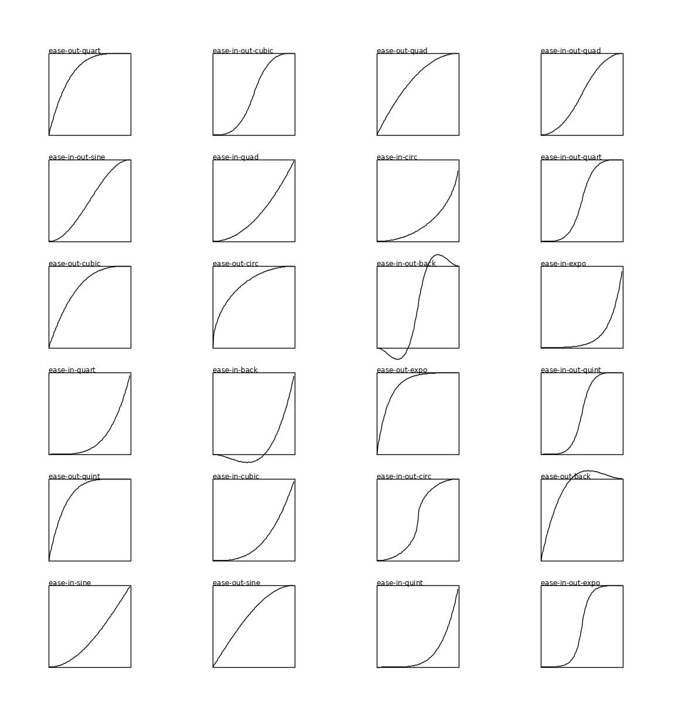

# easings-clj

[](https://clojars.org/com.dedovic/easings-clj)

A Clojure port of the [easings.net](easings.net) easing functions. Orignal source code may be found at [ai/easings.net](https://github.com/ai/easings.net).

## Install
Leiningen/Boot
```clojure
[com.dedovic/easings-clj "0.1.0"]
```
Clojure CLI/deps.edn
```clojure
com.dedovic/easings-clj {:mvn/version "0.1.0"}
```
Gradle
```groovy
compile 'com.dedovic:easings-clj:0.1.0'
```
Maven
```xml
<dependency>
  <groupId>com.dedovic</groupId>
  <artifactId>easings-clj</artifactId>
  <version>0.1.0</version>
</dependency>
```
## Using
```clj
(require 'easings.core :as ease)

(ease/ease-in-sine 0.2)
```

## Cljs tests

On the commandline, compile (and autorun) the node test build:

```console
npx shadow-cljs compile tests
```
or simply
```console
./compile-tests
```

## TODO:
- (2024-06-29): Unit tests in clj?
- (2021-06-21): Elastic functions
- *(2021-06-21): Unit tests? => Done in cljs*
- (2021-06-21): Elastic functions
- (2021-06-21): Bounce functions

## Proof it Works

